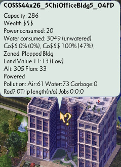
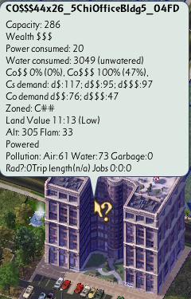

# sc4-growify

A DLL Plugin for SimCity 4 that adds a cheat code to convert plopped buildings to a growable RCI zone type.   

This mod is an in-game equivalent to the [SC4](https://github.com/sebamarynissen/sc4) command line tool's growify
command for editing save games (and the [website version](https://community.simtropolis.com/forums/topic/760843-growifiercom-ploppable-residentials/)).

One of the differences between the two tools is the building exemplar property that is used to detect the RCI building type.    
The SC4 command line tool uses the `Capacity Satisfied` property from the savegame's lot subfile.    
This plugin uses the `Purpose` property from the building's exemplar.

Before:

After:

The plugin can be downloaded from the Releases tab: https://github.com/0xC0000054/sc4-growify/releases

## System Requirements

* SimCity 4 version 641
* Windows 10 or later

The plugin may work on Windows 7 or later with the [Microsoft Visual C++ 2022 x86 Redistribute](https://aka.ms/vs/17/release/vc_redist.x86.exe) installed, but I do not have the ability to test that.

## Installation

1. Close SimCity 4.
2. Copy `SC4Growify.dll` into the Plugins folder in the SimCity 4 installation directory.
3. Start SimCity 4.

## Using the Plugin

The plugin adds a `Growify` cheat code with the following syntax:

`Growify <zone type> <zone density> [make historical]`

The `<zone type>` parameter is one of: `Residential`, `Commercial`, `Agriculture` or `Industrial`.    
The `<zone density>` parameter is one of: `Low`, `Medium` or `High`.    
The `[make historical]` parameter is optional, when not present it will default to `true`. This behavior is intended to prevent
the game from replacing the plopped building as part of its normal zone redevelopment process. Setting the value to `false`
will preserve the game's existing historical option for that lot.

All commands are case-insensitive.

### Examples Commands

The following command converts all commercial plopped buildings to the Commercial Medium-density zone:
`Growify Commercial Medium`
To save typing, you could also use: `Growify Com Med` or `Growify C M`. This works with any zone or density value.

Because the Agriculture zone only has 1 density, it can be used with just the zone name: `Growify Agriculture`.

## Troubleshooting

The plugin should write a `SC4Growify.log` file in the same folder as the plugin.    
The log contains status information for the most recent run of the plugin.

# License

This project is licensed under the terms of the MIT License.    
See [LICENSE.txt](LICENSE.txt) for more information.

## 3rd party code

[gzcom-dll](https://github.com/nsgomez/gzcom-dll/tree/master) Located in the vendor folder, MIT License.    
[EABase](https://github.com/electronicarts/EABase) Located in the vendor folder, BSD 3-Clause License.    
[EASTL](https://github.com/electronicarts/EASTL) Located in the vendor folder, BSD 3-Clause License.    
[Windows Implementation Library](https://github.com/microsoft/wil) - MIT License    
[SC4Fix](https://github.com/nsgomez/sc4fix) - MIT License    
[Boost.Algorithm](https://www.boost.org/doc/libs/1_84_0/libs/algorithm/doc/html/index.html) - Boost Software License, Version 1.0.    

# Source Code

## Prerequisites

* Visual Studio 2022
* [VCPkg](https://github.com/microsoft/vcpkg) with the Visual Studio integration

## Building the plugin

* Open the solution in the `src` folder
* Update the post build events to copy the build output to you SimCity 4 application plugins folder.
* Build the solution

## Debugging the plugin

Visual Studio can be configured to launch SimCity 4 on the Debugging page of the project properties.
I configured the debugger to launch the game in a window with the following command line:    
`-intro:off -CPUcount:1 -w -CustomResolution:enabled -r1920x1080x32`

You may need to adjust the window resolution for your primary screen.
